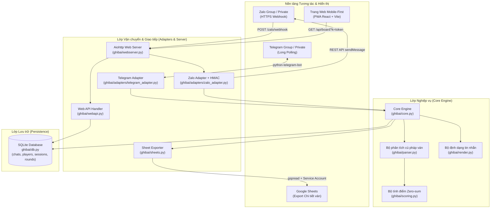
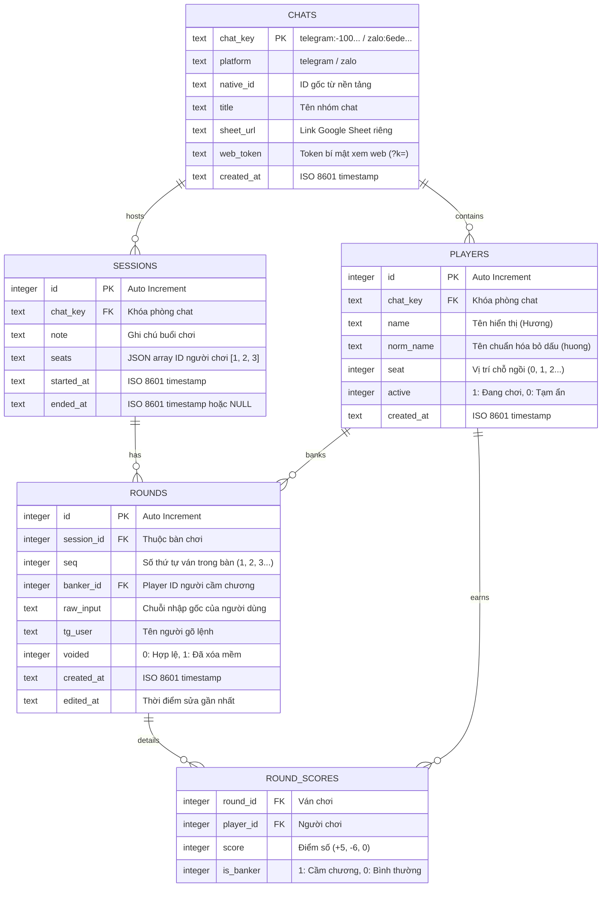

# Cẩm nang Tra cứu & Tài liệu Kỹ thuật — Bot Ghi Bài 3 Cây

Tài liệu này cung cấp bản đồ toàn diện về hệ thống mã nguồn, phân loại tính năng, từ điển lệnh, mô hình cơ sở dữ liệu, đặc tả API và hướng dẫn tra cứu nhanh cho dự án **Bot Ghi Bài 3 Cây**.

---

## 📑 Mục lục

1. [Tổng quan Kiến trúc Hệ thống](#1-tổng-quan-kiến-trúc-hệ-thống)
2. [Bản đồ Tra cứu Nhanh ("Tìm gì ở đâu?")](#2-bản-đồ-tra-cứu-nhanh-tìm-gì-ở-đâu)
3. [Cấu trúc Thư mục & Mô tả Từng File](#3-cấu-trúc-thư-mục--mô-tả-từng-file)
4. [Danh mục Tính năng & Hướng dẫn Kỹ thuật](#4-danh-mục-tính-năng--hướng-dẫn-kỹ-thuật)
5. [Từ điển Lệnh Bot (Command Reference)](#5-từ-điển-lệnh-bot-command-reference)
6. [Mô hình Dữ liệu & SQLite Schema](#6-mô-hình-dữ-liệu--sqlite-schema)
7. [Đặc tả API & Webhook](#7-đặc-tả-api--webhook)
8. [Bảng Biến Môi trường (.env Reference)](#8-bảng-biến-môi-trường-env-reference)
9. [Hướng dẫn Phát triển & Vận hành](#9-hướng-dẫn-phát-triển--vận-hành)

---

## 1. Tổng quan Kiến trúc Hệ thống

Hệ thống được thiết kế theo nguyên lý phân tách trách nhiệm (Separation of Concerns):
- **Core Engine độc lập**: [`Engine`](file:///home/dell/ghi_bai/ghibai/core.py#L93-L507) xử lý toàn bộ nghiệp vụ (tính điểm, quản lý bàn, lệnh chat) mà không phụ thuộc vào bất kỳ nền tảng tin nhắn nào.
- **Multi-Adapter**: [`telegram_adapter.py`](file:///home/dell/ghi_bai/ghibai/adapters/telegram_adapter.py) (Long polling) và [`zalo_adapter.py`](file:///home/dell/ghi_bai/ghibai/adapters/zalo_adapter.py) (Webhook + HMAC) chỉ đóng vai trò lớp vận chuyển.
- **Nguồn sự thật duy nhất (Single Source of Truth)**: Toàn bộ dữ liệu nằm tại SQLite ([`ghibai/db.py`](file:///home/dell/ghi_bai/ghibai/db.py)). Google Sheet và Web Dashboard chỉ là các view đọc dữ liệu.
- **Zero-Sum Scoring Rule**: Người cầm chương ăn/thua trực tiếp với từng người chơi khác, điểm chương luôn tự động tính sao cho tổng một ván bằng đúng 0 ([`ghibai/scoring.py`](file:///home/dell/ghi_bai/ghibai/scoring.py)).



---

## 2. Bản đồ Tra cứu Nhanh ("Tìm gì ở đâu?")

### 🔍 Tra cứu theo Tính năng -> File & Hàm chính

| Bạn muốn tìm hiểu hoặc sửa... | File mã nguồn | Class / Hàm / Biến quan trọng |
|---|---|---|
| **Cú pháp nhận diện điểm ván** (vị trí `, 5, -3, 6` hoặc tên `Hương -5...`) | [`ghibai/parser.py`](file:///home/dell/ghi_bai/ghibai/parser.py) | [`parse_round()`](file:///home/dell/ghi_bai/ghibai/parser.py#L62-L73), [`_parse_positional()`](file:///home/dell/ghi_bai/ghibai/parser.py#L80-L116), [`_parse_named()`](file:///home/dell/ghi_bai/ghibai/parser.py#L118-L184), [`looks_like_round()`](file:///home/dell/ghi_bai/ghibai/parser.py#L52-L60) |
| **Quy tắc tính điểm cầm chương** (tổng ván = 0) | [`ghibai/scoring.py`](file:///home/dell/ghi_bai/ghibai/scoring.py) | [`resolve_scores()`](file:///home/dell/ghi_bai/ghibai/scoring.py#L11-L21) |
| **Logic các lệnh bot** (`/nguoichoi`, `/banmoi`, `/v`, `/undo`, `/xoa`...) | [`ghibai/core.py`](file:///home/dell/ghi_bai/ghibai/core.py) | [`Engine`](file:///home/dell/ghi_bai/ghibai/core.py#L93-L507), [`HANDLERS`](file:///home/dell/ghi_bai/ghibai/core.py#L508-L533), [`help_text()`](file:///home/dell/ghi_bai/ghibai/core.py#L48-L91) |
| **SQLite Schema, Migrations & Truy vấn** | [`ghibai/db.py`](file:///home/dell/ghi_bai/ghibai/db.py) | [`Database`](file:///home/dell/ghi_bai/ghibai/db.py#L119-L539), [`SCHEMA`](file:///home/dell/ghi_bai/ghibai/db.py#L19-L80), [`chat_key()`](file:///home/dell/ghi_bai/ghibai/db.py#L83-L85), [`_repair_dangling_refs()`](file:///home/dell/ghi_bai/ghibai/db.py#L209-L245) |
| **Định dạng bảng tin nhắn Telegram vs Zalo** | [`ghibai/render.py`](file:///home/dell/ghi_bai/ghibai/render.py) | [`TelegramFmt`](file:///home/dell/ghi_bai/ghibai/render.py#L26-L58), [`ZaloFmt`](file:///home/dell/ghi_bai/ghibai/render.py#L60-L95), [`standings()`](file:///home/dell/ghi_bai/ghibai/render.py#L150-L160), [`history()`](file:///home/dell/ghi_bai/ghibai/render.py#L162-L173) |
| **Export Google Sheet, tô màu chương, freeze pane** | [`ghibai/sheets.py`](file:///home/dell/ghi_bai/ghibai/sheets.py) | [`SheetExporter`](file:///home/dell/ghi_bai/ghibai/sheets.py#L41-L208), [`build_table()`](file:///home/dell/ghi_bai/ghibai/sheets.py#L227-L250), [`_format_requests()`](file:///home/dell/ghi_bai/ghibai/sheets.py#L101-L187) |
| **API REST `/api/board` phục vụ Web** | [`ghibai/webapi.py`](file:///home/dell/ghi_bai/ghibai/webapi.py) | [`WebApi.board()`](file:///home/dell/ghi_bai/ghibai/webapi.py#L24-L44), [`_authenticate()`](file:///home/dell/ghi_bai/ghibai/webapi.py#L45-L54) |
| **HTTP Server Aiohttp (Webhook + Web + SPA static)** | [`ghibai/webserver.py`](file:///home/dell/ghi_bai/ghibai/webserver.py) | [`build_app()`](file:///home/dell/ghi_bai/ghibai/webserver.py#L23-L34), [`_spa()`](file:///home/dell/ghi_bai/ghibai/webserver.py#L41-L59), [`start()`](file:///home/dell/ghi_bai/ghibai/webserver.py#L71-L77) |
| **Telegram Polling & Đăng ký menu lệnh** | [`ghibai/adapters/telegram_adapter.py`](file:///home/dell/ghi_bai/ghibai/adapters/telegram_adapter.py) | [`build_application()`](file:///home/dell/ghi_bai/ghibai/adapters/telegram_adapter.py#L42-L48), [`setup()`](file:///home/dell/ghi_bai/ghibai/adapters/telegram_adapter.py#L50-L70), [`_on_message()`](file:///home/dell/ghi_bai/ghibai/adapters/telegram_adapter.py#L72-L94) |
| **Zalo Webhook, Xác thực HMAC, Chống lặp update** | [`ghibai/adapters/zalo_adapter.py`](file:///home/dell/ghi_bai/ghibai/adapters/zalo_adapter.py) | [`ZaloClient`](file:///home/dell/ghi_bai/ghibai/adapters/zalo_adapter.py#L51-L94), [`ZaloWebhook`](file:///home/dell/ghi_bai/ghibai/adapters/zalo_adapter.py#L115-L190), [`SeenMessages`](file:///home/dell/ghi_bai/ghibai/adapters/zalo_adapter.py#L97-L113) |
| **CLI quản lý / debug Zalo Webhook** | [`ghibai/cli.py`](file:///home/dell/ghi_bai/ghibai/cli.py) | [`main()`](file:///home/dell/ghi_bai/ghibai/cli.py#L19-L38), [`_run()`](file:///home/dell/ghi_bai/ghibai/cli.py#L40-L65) |
| **Đọc cấu hình `.env` & kiểm tra quyền ghi DB** | [`ghibai/config.py`](file:///home/dell/ghi_bai/ghibai/config.py) | [`load_config()`](file:///home/dell/ghi_bai/ghibai/config.py#L43-L92), [`_ensure_writable()`](file:///home/dell/ghi_bai/ghibai/config.py#L112-L125) |
| **Khởi động Bot song song & Xử lý tín hiệu tắt** | [`ghibai/bot.py`](file:///home/dell/ghi_bai/ghibai/bot.py) | [`run()`](file:///home/dell/ghi_bai/ghibai/bot.py#L24-L89), [`main()`](file:///home/dell/ghi_bai/ghibai/bot.py#L150-L165) |
| **Chuẩn hóa tiếng Việt & Bỏ mention bot** | [`ghibai/text.py`](file:///home/dell/ghi_bai/ghibai/text.py) | [`normalize()`](file:///home/dell/ghi_bai/ghibai/text.py#L10-L15), [`strip_bot_mention()`](file:///home/dell/ghi_bai/ghibai/text.py#L27-L39) |
| **Giao diện Web Frontend (React + Tailwind + shadcn)** | [`web/src/App.tsx`](file:///home/dell/ghi_bai/web/src/App.tsx) | Bố cục chính, tab Bảng xếp hạng / Lịch sử, dark mode, PWA token |
| **Hook lấy dữ liệu & Auto-refresh Web** | [`web/src/hooks/use-board.ts`](file:///home/dell/ghi_bai/web/src/hooks/use-board.ts) | `useBoard()`: Polling 15s, pause khi ẩn tab, offline fallback |
| **Component hiển thị ván (Card trên mobile, Table trên PC)** | [`web/src/components/rounds-view.tsx`](file:///home/dell/ghi_bai/web/src/components/rounds-view.tsx) | `RoundsView`: Responsive rendering, highlight người cầm chương |

---

## 3. Cấu trúc Thư mục & Mô tả Từng File

```
.
├── ghibai/                       # Backend Python (Core, Adapters, Web Server, DB)
│   ├── __init__.py               # Package marker
│   ├── adapters/                 # Lớp kết nối nền tảng
│   │   ├── __init__.py           # Package marker
│   │   ├── telegram_adapter.py   # Telegram Bot (python-telegram-bot, long polling)
│   │   └── zalo_adapter.py       # Zalo Bot (REST API, Webhook, HMAC auth, deduplication)
│   ├── bot.py                    # Điểm khởi chạy chính: chạy song song Telegram + Zalo + HTTP
│   ├── cli.py                    # Công cụ CLI `ghibai-zalo` quản trị webhook Zalo
│   ├── config.py                 # Load và xác thực biến môi trường từ .env
│   ├── core.py                   # Bộ máy xử lý lệnh và nghiệp vụ (không phụ thuộc platform)
│   ├── db.py                     # SQLite access layer, schema migrations, models
│   ├── parser.py                 # Phân tích tin nhắn điểm ván (vị trí hoặc theo tên)
│   ├── render.py                 # Định dạng tin nhắn phản hồi (Telegram HTML vs Zalo block)
│   ├── scoring.py                # Tính toán điểm zero-sum cho người cầm chương
│   ├── sheets.py                 # Xuất dữ liệu bàn chơi sang Google Sheets (gspread)
│   ├── text.py                   # Tiện ích chuẩn hóa tiếng Việt không dấu và lọc @mention
│   ├── webapi.py                 # Endpoint API JSON `/api/board` phục vụ Web UI
│   └── webserver.py              # Aiohttp HTTP server cho webhook, API và file tĩnh SPA
├── web/                          # Frontend React SPA / PWA (Mobile-First)
│   ├── package.json              # Định nghĩa dependencies npm & scripts
│   ├── vite.config.ts            # Cấu hình Vite & Proxy API sang backend
│   ├── index.html                # HTML entrypoint, PWA meta tags & icons
│   ├── src/
│   │   ├── App.tsx               # Component gốc, quản lý layout và dialogs
│   │   ├── main.tsx              # React DOM render & ThemeProvider wrapper
│   │   ├── index.css             # Tailwind v4 styles & CSS variables
│   │   ├── components/           # UI Components nghiệp vụ
│   │   │   ├── board-header.tsx  # Header hiển thị tên nhóm, platform, nút refresh/share
│   │   │   ├── board-stats.tsx   # Thẻ tóm tắt: Tổng ván, Người chơi, Đang cầm chương
│   │   │   ├── board-states.tsx  # Trạng thái tải (Skeleton), lỗi (404/Network), bàn trống
│   │   │   ├── standings-list.tsx# Bảng xếp hạng điểm tích lũy của bàn hiện tại
│   │   │   ├── rounds-view.tsx   # Chi tiết từng ván (Thẻ ở Mobile, Bảng ở Desktop)
│   │   │   ├── settings-dialog.tsx# Dialog cấu hình: đổi token link, giao diện sáng/tối
│   │   │   ├── theme-provider.tsx# Quản lý theme (light / dark / system)
│   │   │   └── ui/               # Base shadcn/ui components (button, card, table...)
│   │   ├── hooks/
│   │   │   └── use-board.ts      # Custom hook quản lý fetch dữ liệu, cache và polling
│   │   └── lib/
│   │       ├── api.ts            # TypeScript interfaces khớp API backend
│   │       ├── format.ts         # Hàm format số signed (+5, -3), ngày giờ HH:mm
│   │       ├── settings.ts       # Quản lý local preferences
│   │       ├── token.ts          # Quản lý token xác thực trong URL (?k=) và localStorage
│   │       └── utils.ts          # Tiện ích gộp class Tailwind (clsx + twMerge)
│   └── public/                   # PWA Icons & manifest assets
├── tests/                        # Toàn bộ test suite (Pytest - 134 test cases)
│   ├── conftest.py               # Fixtures dùng chung
│   ├── test_core.py              # Test logic xử lý lệnh bot, session, roster
│   ├── test_db.py                # Test CRUD SQLite, rounds, voiding, stats
│   ├── test_migration.py         # Test nâng cấp database v1 -> v2 -> v3
│   ├── test_parser.py            # Test parser điểm ván (vị trí, tên, dấu, lỗi)
│   ├── test_render.py            # Test định dạng tin nhắn Telegram vs Zalo
│   ├── test_scoring.py           # Test luật tính điểm zero-sum
│   ├── test_sheets.py            # Test logic dựng bảng và format Google Sheet
│   ├── test_webapi.py            # Test xác thực token và payload `/api/board`
│   └── test_zalo.py              # Test xác thực webhook, deduplication, ZaloClient
├── data/                         # Thư mục chứa database SQLite (`ghibai.db`)
├── secrets/                      # Thư mục chứa JSON key Service Account Google Cloud
├── .env.example                  # File mẫu biến môi trường
├── Dockerfile                    # Multi-stage Docker build (Node web build + Python app)
├── docker-compose.yml            # Docker Compose deployment configuration
├── main.py                       # Điểm vào phụ: gọi `ghibai.bot:main`
├── pyproject.toml                # Cấu hình project Python, dependencies & entrypoints
└── README.md                     # Hướng dẫn sử dụng nhanh tổng quan
```

---

## 4. Danh mục Tính năng & Hướng dẫn Kỹ thuật

### 4.1. Luật Tính Điểm 3 Cây (Zero-Sum Scoring)
- **Đặc tả**: Trong bài 3 cây ngoài đời, người cầm chương (nhà cái) ăn hoặc trả điểm trực tiếp với từng người chơi khác. Do đó, điểm của người cầm chương luôn bằng số đối của tổng điểm tất cả những người còn lại:
  $$\text{Điểm chương} = - \sum \text{Điểm người chơi khác}$$
- **Quy tắc bất biến**: Tổng điểm của tất cả người chơi trong một ván **luôn luôn bằng 0**.
- **Xử lý mã nguồn**: [`ghibai/scoring.py:resolve_scores`](file:///home/dell/ghi_bai/ghibai/scoring.py#L11-L20).
- **Lưu ý**: Người nhập **không bao giờ điền điểm của người cầm chương** (để ô trống hoặc không ghi số). Bot sẽ tự động tính toán. Điểm `0` là điểm thật của người chơi hòa ván đó.

---

### 4.2. Bộ Nhập Điểm Thông Minh (Dual-Mode Parser)
Xử lý tại [`ghibai/parser.py`](file:///home/dell/ghi_bai/ghibai/parser.py) với 2 cú pháp linh hoạt:

1. **Cú pháp theo vị trí (Positional - Nhanh nhất)**:
   - Số lượng ô ngăn cách bởi dấu phẩy `,` phải bằng đúng số lượng người chơi trong bàn.
   - Ô trống (hoặc chữ `c`) biểu thị người cầm chương.
   - Ký tự `x` biểu thị người chơi bỏ ván (ngồi ngoài, không phát sinh điểm).
   - Ví dụ: Danh sách chỗ ngồi là `Hương, Hằng, Toàn, Thu`:
     - `-5, 5, , 6` $\rightarrow$ Toàn cầm chương, bot tính Toàn = $-(-5 + 5 + 6) = -6$.
     - `, 5, -7, 6` $\rightarrow$ Hương cầm chương (ô đầu trống).
     - `-5, 5, 6, ` $\rightarrow$ Thu cầm chương (ô cuối trống).
     - `-5, 5, , x` $\rightarrow$ Thu bỏ ván.

2. **Cú pháp theo tên (Named - Tự do)**:
   - Không cần nhớ thứ tự chỗ ngồi.
   - Không phân biệt hoa/thường, không cần gõ dấu tiếng Việt (`hang` = `Hằng`).
   - Người cầm chương được chỉ định bằng:
     - Tên trần không kèm số: `Hương -5, Hằng 5, Toàn, Thu 6`
     - Dấu hoa thị `*`: `Toàn*, Hương -5, Hằng 5, Thu 6`
     - Tiền tố `c:`: `c:Toàn Hương -5 Hằng 5 Thu 6`
     - Tự suy luận: Nếu nhập điểm cho 3 người trong bàn 4 người, người vắng mặt duy nhất được tính là cầm chương.

3. **Cơ chế chống bắt nhầm tin nhắn chat thường**:
   - Hàm [`looks_like_round()`](file:///home/dell/ghi_bai/ghibai/parser.py#L52-L60) kiểm tra tin nhắn không có prefix lệnh. Tin nhắn chỉ được coi là ván đấu nếu khớp khuôn mẫu vị trí chứa số và dấu phẩy, hoặc chứa ít nhất 2 tên người chơi trong danh sách. Các câu chat thông thường như *"tối nay đánh tiếp không"* sẽ hoàn toàn bị bỏ qua.

---

### 4.3. Quản lý Bàn chơi & Người chơi (Sessions & Rosters)
- **Tách biệt theo phòng chat (`chat_key`)**: Mỗi nhóm chat Telegram hoặc Zalo có danh sách người chơi (`roster`), bàn chơi (`session`), và lịch sử hoàn toàn độc lập ([`ghibai/db.py:chat_key`](file:///home/dell/ghi_bai/ghibai/db.py#L83-L85)).
- **Tự động mở bàn**: Nếu người dùng nhập điểm một ván khi chưa gõ `/banmoi`, bot sẽ tự động tạo bàn mới với danh sách người chơi hiện tại ([`ghibai/core.py:_record`](file:///home/dell/ghi_bai/ghibai/core.py#L246-L266)).
- **Đồng bộ ghế động (Dynamic Seat Sync)**: Khi thêm (`/themnguoi`) hoặc bớt (`/xoanguoi`) người chơi trong khi bàn đang diễn ra, bàn chơi hiện tại sẽ lập tức cập nhật lại số ghế để các ván tiếp theo nhận đúng số lượng ô ([`ghibai/core.py:_sync_seats`](file:///home/dell/ghi_bai/ghibai/core.py#L207-L214)).

---

### 4.4. Cơ chế Sửa sai, Soft-Delete & Undo An toàn
- **Xóa mềm (Soft Delete)**: Các ván bị xóa (`/undo`, `/xoa`, `/xoaban`) chỉ bị đánh dấu `voided = 1` trong database ([`ghibai/db.py:void_round`](file:///home/dell/ghi_bai/ghibai/db.py#L459-L470)). Dữ liệu điểm không bị mất vĩnh viễn và bị loại khỏi tổng điểm.
- **Khôi phục ván (`/khoiphuc`)**: Có thể khôi phục lại bất kỳ ván nào đã xóa theo số thứ tự (`/khoiphuc 3`).
- **Sửa ván giữ nguyên số thứ tự (`/sua <số_ván> <kết_quả>`)**: Cập nhật lại điểm của ván cũ mà không làm lệch số thứ tự ván của cả buổi ([`ghibai/db.py:replace_round`](file:///home/dell/ghi_bai/ghibai/db.py#L423-L440)).

---

### 4.5. Trang Web Mobile-First & PWA Dashboard
- **Kiến trúc**: Xây dựng bằng React + Vite + Tailwind CSS v4 + shadcn/ui ([`web/`](file:///home/dell/ghi_bai/web)).
- **Chỉ đọc (Read-only)**: Trang web hoàn toàn không có tính năng chỉnh sửa điểm để đảm bảo an toàn, mọi thay đổi phải xuất phát từ trong nhóm chat.
- **Xác thực bảo mật qua Token URL**: Mỗi phòng chat có một `web_token` ngẫu nhiên ([`ghibai/db.py:reset_web_token`](file:///home/dell/ghi_bai/ghibai/db.py#L278-L283)). Link có dạng `https://domain/?k=<token>`. Khi link bị lộ ra ngoài nhóm, dùng lệnh `/web doilink` để hủy token cũ ngay lập tức.
- **Giao diện thích ứng (Adaptive Layout)**:
  - Trên điện thoại di động: Hiển thị chi tiết từng ván theo dạng thẻ Card phân cấp rõ ràng, dễ đọc, không bị tràn màn hình hay scroll ngang ([`web/src/components/rounds-view.tsx`](file:///home/dell/ghi_bai/web/src/components/rounds-view.tsx)).
  - Trên máy tính (`md:` trở lên): Hiển thị bảng chi tiết đa cột.
- **Tối ưu năng lượng & Dữ liệu mạng**:
  - Tự động poll API `/api/board` mỗi 15 giây khi màn hình đang bật ([`web/src/hooks/use-board.ts`](file:///home/dell/ghi_bai/web/src/hooks/use-board.ts)).
  - Khi người dùng khóa màn hình hoặc chuyển tab (`visibilitychange`), dừng hoàn toàn polling.
  - Hỗ trợ xem offline dữ liệu gần nhất kèm cảnh báo nếu mất kết nối mạng.
  - Cài đặt được lên màn hình chính (Add to Home Screen - PWA), tự lưu token vào `localStorage`.

---

### 4.6. Xuất Dữ liệu Google Sheets Tự động
- **Tự động format & highlight**: Sử dụng thư viện `gspread` và Service Account ([`ghibai/sheets.py`](file:///home/dell/ghi_bai/ghibai/sheets.py)).
- **Tính toán nguồn sự thật**: Mỗi lần gõ `/export`, toàn bộ tab `Chi tiết ván` sẽ được ghi đè từ SQLite. Chạy nhiều lần không bao giờ bị trùng dòng.
- **Trình bày chuyên nghiệp & Tối giản**:
  - Dòng 1: Tiêu đề bàn chơi và ngày tháng.
  - Dòng 2: Header gồm cột `Giờ` và các cột tên người chơi (đã loại bỏ cột `Ván` và `Chương` dư thừa).
  - Thân bảng: Điểm số thực tế (có thể dùng công thức tính toán trong Sheet).
  - Ô của người cầm chương trong từng ván được tô màu nền vàng (`#FFE699`) ngay tại cột của người đó để dễ nhận biết.
  - Dòng tổng kết cuối bảng: `["TONG", <tổng_điểm_từng_người>]` có màu nền nổi bật.
  - Cố định dòng tiêu đề & header (Freeze 2 rows) và cột Giờ (Freeze 1 column).
- **Xử lý lỗi quyền thân thiện**: Nếu Google Sheet chưa được share cho Service Account, bot sẽ trích xuất mã lỗi 403/404 và gửi lại tin nhắn hướng dẫn kèm đúng email Service Account cần cấp quyền Editor.

---

### 4.7. Khả năng Chạy Song Song & Xử lý Đặc thù Nền tảng
- **Đa nền tảng trong 1 tiến trình**: Chạy đồng thời Telegram Polling và Zalo Webhook trong [`ghibai/bot.py`](file:///home/dell/ghi_bai/ghibai/bot.py).
- **Zalo Webhook Chống Retry (Deduplication)**: Zalo tự động gửi lại update nếu máy chủ phản hồi chậm. Lớp [`ZaloWebhook`](file:///home/dell/ghi_bai/ghibai/adapters/zalo_adapter.py#L115-L160) lập tức trả về HTTP `200` cho Zalo rồi xử lý nền, đồng thời lọc trùng lặp qua `message_id` với bộ nhớ đệm [`SeenMessages`](file:///home/dell/ghi_bai/ghibai/adapters/zalo_adapter.py#L97-L113).
- **Phân tách giới hạn tin nhắn**:
  - Telegram: Tối đa 4096 ký tự/tin, hỗ trợ HTML `<pre>` để căn cột bảng.
  - Zalo: Tối đa 2000 ký tự/tin, chỉ hỗ trợ `<b>`, `<i>`, `<u>`, `<s>` (không có monospace). Tự động dùng layout dạng khối phân dòng thay vì bảng để tránh vỡ chữ ([`ghibai/render.py:ZaloFmt`](file:///home/dell/ghi_bai/ghibai/render.py#L60-L95)).
  - [`split_message()`](file:///home/dell/ghi_bai/ghibai/render.py#L97-L115) tự động cắt tin nhắn theo ranh giới dòng mà không làm gãy bảng hay khối nội dung.

---

## 5. Từ điển Lệnh Bot (Command Reference)

> **Ghi chú về Prefix**: Telegram sử dụng prefix `/`, Zalo sử dụng prefix `#` (do Zalo không có popup gợi ý lệnh dạng `/`). Cả hai nền tảng đều chấp nhận cả `/` và `#`.

| Lệnh Telegram | Lệnh Zalo | Tham số | Ý nghĩa & Hành vi | Ví dụ | File thực thi |
|---|---|---|---|---|---|
| `/help` · `/start` | `#help` · `#start` | Không | Hiển thị bảng hướng dẫn sử dụng bot đầy đủ | `/help` | [`ghibai/core.py:help_text`](file:///home/dell/ghi_bai/ghibai/core.py#L48-L91) |
| `/nguoichoi` | `#nguoichoi` | `Tên 1, Tên 2, ...` | Khai báo/đặt lại danh sách người chơi theo thứ tự chỗ ngồi | `/nguoichoi Hương, Hằng, Toàn, Thu` | [`ghibai/core.py:cmd_nguoichoi`](file:///home/dell/ghi_bai/ghibai/core.py#L159-L172) |
| `/dsnguoi` | `#dsnguoi` | Không | Xem danh sách người chơi và thứ tự chỗ ngồi hiện tại | `/dsnguoi` | [`ghibai/core.py:cmd_dsnguoi`](file:///home/dell/ghi_bai/ghibai/core.py#L173-L175) |
| `/themnguoi` | `#themnguoi` | `Tên` | Thêm một người chơi mới vào cuối danh sách chỗ ngồi | `/themnguoi Nam` | [`ghibai/core.py:cmd_themnguoi`](file:///home/dell/ghi_bai/ghibai/core.py#L176-L188) |
| `/xoanguoi` | `#xoanguoi` | `Tên` | Tạm ẩn một người chơi khỏi danh sách chỗ ngồi | `/xoanguoi Nam` | [`ghibai/core.py:cmd_xoanguoi`](file:///home/dell/ghi_bai/ghibai/core.py#L189-L206) |
| `/banmoi` | `#banmoi` | `[Ghi chú]` | Mở một bàn chơi mới (bắt buộc chốt bàn cũ trước) | `/banmoi Tối thứ 7` | [`ghibai/core.py:cmd_banmoi`](file:///home/dell/ghi_bai/ghibai/core.py#L217-L227) |
| `/ketthuc` | `#ketthuc` | Không | Chốt bàn chơi đang mở và in kết quả chung cuộc | `/ketthuc` | [`ghibai/core.py:cmd_ketthuc`](file:///home/dell/ghi_bai/ghibai/core.py#L228-L240) |
| `/v` · `/van` | `#v` · `#van` | `Điểm ván` | Ghi điểm một ván (dùng khi muốn chắc chắn không bị lọt tin) | `/v -5, 5, , 6` | [`ghibai/core.py:cmd_v`](file:///home/dell/ghi_bai/ghibai/core.py#L243-L245) |
| *(Tin nhắn trần)* | *(Tin nhắn trần)* | `Điểm ván` | Tự động ghi ván khi tin nhắn khớp cấu trúc điểm | `-5, 5, , 6` hoặc `Hương -5 Toàn` | [`ghibai/core.py:handle`](file:///home/dell/ghi_bai/ghibai/core.py#L127-L131) |
| `/sua` | `#sua` | `<số_ván> <điểm_mới>` | Sửa lại điểm của một ván đã ghi (giữ nguyên số thứ tự) | `/sua 3 -5, 5, , 6` | [`ghibai/core.py:cmd_sua`](file:///home/dell/ghi_bai/ghibai/core.py#L267-L291) |
| `/undo` | `#undo` | Không | Hủy ván vừa ghi gần nhất (xóa mềm) | `/undo` | [`ghibai/core.py:cmd_undo`](file:///home/dell/ghi_bai/ghibai/core.py#L304-L312) |
| `/xoa` | `#xoa` | `<số_ván...>` | Xóa một hoặc nhiều ván theo số thứ tự | `/xoa 3` hoặc `/xoa 3 5 7` | [`ghibai/core.py:cmd_xoa`](file:///home/dell/ghi_bai/ghibai/core.py#L313-L332) |
| `/khoiphuc` | `#khoiphuc` | `<số_ván...>` | Khôi phục lại các ván đã bị xóa | `/khoiphuc 3` | [`ghibai/core.py:cmd_khoiphuc`](file:///home/dell/ghi_bai/ghibai/core.py#L333-L357) |
| `/xoaban` | `#xoaban` | `xacnhan` | Xóa sạch tất cả các ván trong bàn đang chơi | `/xoaban xacnhan` | [`ghibai/core.py:cmd_xoaban`](file:///home/dell/ghi_bai/ghibai/core.py#L358-L376) |
| `/bang` | `#bang` | Không | Xem bảng tổng điểm lũy kế của bàn đang chơi | `/bang` | [`ghibai/core.py:cmd_bang`](file:///home/dell/ghi_bai/ghibai/core.py#L392-L406) |
| `/lichsu` | `#lichsu` | `[số_lượng]` | Xem chi tiết các ván gần nhất (mặc định 15 ván) | `/lichsu 10` | [`ghibai/core.py:cmd_lichsu`](file:///home/dell/ghi_bai/ghibai/core.py#L407-L418) |
| `/xh` | `#xh` | Không | Bảng xếp hạng thành tích tích lũy mọi bàn trong phòng | `/xh` | [`ghibai/core.py:cmd_xh`](file:///home/dell/ghi_bai/ghibai/core.py#L419-L421) |
| `/web` · `/link` | `#web` · `#link` | `[doilink]` | Lấy link xem bàn chơi trên web hoặc đổi token mới | `/web` hoặc `/web doilink` | [`ghibai/core.py:cmd_web`](file:///home/dell/ghi_bai/ghibai/core.py#L424-L444) |
| `/sheet` | `#sheet` | `[link_sheet]` | Xem hoặc lưu link Google Sheet cho phòng chat này | `/sheet https://docs.google...` | [`ghibai/core.py:cmd_sheet`](file:///home/dell/ghi_bai/ghibai/core.py#L447-L466) |
| `/export` | `#export` | `[link_sheet]` | Xuất toàn bộ chi tiết các ván của bàn lên Google Sheet | `/export` | [`ghibai/core.py:cmd_export`](file:///home/dell/ghi_bai/ghibai/core.py#L467-L495) |

---

## 6. Mô hình Dữ liệu & SQLite Schema

Cơ sở dữ liệu SQLite được quản lý tại [`ghibai/db.py`](file:///home/dell/ghi_bai/ghibai/db.py) với `SCHEMA_VERSION = 3`.



### Các bước Migrations & Cơ chế Tự sửa lỗi (Self-Repair)
1. **v1 $\rightarrow$ v2**: Chuyển đổi `chat_id` dạng số nguyên (chỉ hỗ trợ Telegram) sang chuỗi `chat_key` dạng `<platform>:<native_id>` để hỗ trợ Zalo ID dạng hex string ([`ghibai/db.py:_upgrade_v1_to_v2`](file:///home/dell/ghi_bai/ghibai/db.py#L170-L206)).
2. **v2 $\rightarrow$ v3**: Bổ sung cột `web_token` và index unique vào bảng `chats` để phục vụ xác thực Web UI ([`ghibai/db.py:_add_web_token_column`](file:///home/dell/ghi_bai/ghibai/db.py#L153-L157)).
3. **Cơ chế sửa Foreign Key hỏng (`_repair_dangling_refs`)**: Tự động phát hiện và khắc phục các bảng `rounds` / `round_scores` trỏ tới bảng tạm `_v1` do lỗi PRAGMA `legacy_alter_table` trước đây ([`ghibai/db.py:_repair_dangling_refs`](file:///home/dell/ghi_bai/ghibai/db.py#L209-L245)).

---

## 7. Đặc tả API & Webhook

### 7.1. Health Check Endpoint
- **URL**: `GET /healthz`
- **Mục đích**: Docker healthcheck & kiểm tra reverse proxy.
- **Phản hồi**: `200 OK`
  ```json
  {"ok": true}
  ```

---

### 7.2. Zalo Webhook Endpoint
- **URL**: `POST /zalo/webhook`
- **Xác thực**: Header `X-Bot-Api-Secret-Token` phải khớp với `ZALO_SECRET_TOKEN` trong `.env` (so sánh an toàn bằng [`hmac.compare_digest`](file:///home/dell/ghi_bai/ghibai/adapters/zalo_adapter.py#L130)).
- **Xử lý sự kiện**:
  - Nhận sự kiện `message.text.received`.
  - Trả về `200 OK` ngay lập tức để tránh Zalo retry do timeout.
  - Đưa tác vụ vào background task và lọc trùng lặp qua `message_id`.

---

### 7.3. Board Data Endpoint (Dành cho Web PWA)
- **URL**: `GET /api/board?k=<web_token>`
- **Xác thực**: Truy vấn qua query param `k`. Nếu token không tồn tại, trả về `404 Not Found`.
- **Cấu trúc JSON phản hồi**:
  ```json
  {
    "chat": {
      "title": "Hội Đánh Bài Cuối Tuần",
      "platform": "telegram"
    },
    "session": {
      "id": 12,
      "note": "Bàn tối thứ 7",
      "startedAt": "2026-09-02T20:00:00+07:00",
      "endedAt": null,
      "live": true,
      "played": 15
    },
    "players": [
      {"id": 1, "name": "Hương", "seat": 0},
      {"id": 2, "name": "Hằng", "seat": 1},
      {"id": 3, "name": "Toàn", "seat": 2},
      {"id": 4, "name": "Thu", "seat": 3}
    ],
    "standings": [
      {"id": 4, "name": "Thu", "total": 18, "played": 15, "banked": 3},
      {"id": 1, "name": "Hương", "total": 5, "played": 15, "banked": 4},
      {"id": 2, "name": "Hằng", "total": -8, "played": 14, "banked": 2},
      {"id": 3, "name": "Toàn", "total": -15, "played": 15, "banked": 6}
    ],
    "rounds": [
      {
        "seq": 1,
        "at": "2026-09-02T20:05:00+07:00",
        "bankerId": 3,
        "scores": {"1": -5, "2": 5, "3": -6, "4": 6}
      }
    ],
    "voidedSeqs": [4],
    "checksum": 0,
    "fetchedAt": "2026-09-02T20:30:00+07:00"
  }
  ```

---

## 8. Bảng Biến Môi trường (.env Reference)

| Tên biến | Kiểu / Mặc định | Bắt buộc khi... | Mô tả chi tiết & Hướng dẫn |
|---|---|---|---|
| `TELEGRAM_BOT_TOKEN` | `string` (trống) | Bật Telegram | Token lấy từ [@BotFather](https://t.me/BotFather). Để trống sẽ tắt Telegram. |
| `TELEGRAM_CHAT_ID` | `csv string` (trống) | Tùy chọn | Danh sách `chat_id` Telegram được phép sử dụng bot. Để trống = cho phép mọi chat. |
| `ZALO_BOT_TOKEN` | `string` (trống) | Bật Zalo | Token tạo tại [Zalo Bot Creator](https://zalo.me/s/botcreator/). Để trống sẽ tắt Zalo. |
| `ZALO_SECRET_TOKEN` | `string` (8-256 ký tự) | **Bắt buộc nếu bật Zalo** | Khóa bí mật xác thực webhook Zalo. Tạo bằng lệnh: `openssl rand -hex 24`. |
| `ZALO_WEBHOOK_URL` | `string (HTTPS)` | Bật Zalo | URL công khai trỏ tới `/zalo/webhook` (vd: `https://sam.mihb.site/zalo/webhook`). |
| `ZALO_CHAT_ID` | `csv string` (trống) | Tùy chọn | Danh sách `chat_id` Zalo được phép sử dụng bot. Để trống = cho phép mọi chat. |
| `WEB_HOST` | `string` (`0.0.0.0`) | Tùy chọn | Địa chỉ IP lắng nghe của HTTP Server. |
| `WEB_PORT` | `int` (`10240`) | Tùy chọn | Cổng HTTP Server cho Webhook Zalo và Web UI. |
| `WEB_UI` | `bool` (`1` / `true`) | Tùy chọn | `1`: Bật trang web và API `/api/board`. `0`: Tắt hoàn toàn web UI. |
| `WEB_PUBLIC_URL` | `string` (trống) | Dùng lệnh `/web` | URL gốc công khai của trang web để bot gửi link vào nhóm (vd: `https://sam.mihb.site`). |
| `WEB_DIST` | `path` (`./web/dist`) | Dùng Web UI | Thư mục chứa bản build tĩnh của React frontend. |
| `GOOGLE_SA_JSON` | `path` (`./secrets/service_account.json`) | Dùng `/export` | Đường dẫn file JSON khóa của Google Cloud Service Account. |
| `DEFAULT_SHEET_URL` | `string` (trống) | Tùy chọn | Link Google Sheet mặc định khi nhóm chưa tự gán bằng lệnh `/sheet`. |
| `SHEET_TAB_NAME` | `string` (`Chi tiet van`) | Tùy chọn | Tên tab sẽ được tạo và ghi đè trên Google Sheet khi gõ `/export`. |
| `DB_PATH` | `path` (`./data/ghibai.db`) | Mặc định | Đường dẫn file SQLite database. Tự tạo thư mục và file nếu chưa có. |
| `TZ` | `string` (`Asia/Ho_Chi_Minh`) | Docker | Múi giờ hiển thị cho cột Giờ trong Google Sheet và Web. |
| `DOCKER_UID` / `DOCKER_GID` | `int` (`1000`) | Docker | UID/GID của user trên máy chủ host để container ghi được vào `./data`. |

---

## 9. Hướng dẫn Phát triển & Vận hành

### 9.1. Khởi chạy Môi trường Phát triển (Local Dev)
1. **Cài đặt Python Backend với `uv`**:
   ```bash
   uv sync
   cp .env.example .env
   # Điền ít nhất một token (Telegram hoặc Zalo) vào file .env
   uv run ghibai
   ```

2. **Chạy Dev Server Frontend (Hot Reload)**:
   ```bash
   cd web
   npm install
   npm run dev
   # Mở http://localhost:5173/?k=<token_lấy_từ_lệnh_/web>
   ```

3. **Chạy Kiểm thử (Test Suite)**:
   ```bash
   uv run pytest
   ```

4. **Build bản phân phối Web**:
   ```bash
   cd web
   npm run build
   # Kết quả nằm tại web/dist/
   ```

---

### 9.2. Quản trị Zalo Webhook qua CLI (`ghibai-zalo`)
Không cần khởi động toàn bộ bot, bạn có thể kiểm tra và cấu hình webhook Zalo nhanh bằng công cụ dòng lệnh đi kèm:

```bash
# Kiểm tra token Zalo hợp lệ và in thông tin bot
uv run ghibai-zalo getme

# Đăng ký webhook với URL từ file .env
uv run ghibai-zalo setwebhook

# Đăng ký webhook với một URL tùy chỉnh
uv run ghibai-zalo setwebhook https://sam.mihb.site/zalo/webhook

# Xem thông tin cấu hình webhook hiện tại và trạng thái kiểm tra từ Zalo
uv run ghibai-zalo info

# Hủy đăng ký webhook
uv run ghibai-zalo delete

# Gửi thử một tin nhắn tới chat_id cụ thể
uv run ghibai-zalo send 6ede9afa66b88fe6d6a9 "Xin chào từ CLI"
```

---

### 9.3. Triển khai Production bằng Docker Compose

```bash
# 1. Chuẩn bị file cấu hình môi trường
cp .env.example .env
# Chỉnh sửa token và domain vào .env

# 2. Đồng bộ UID/GID của host để container có quyền ghi vào ./data
echo "DOCKER_UID=$(id -u)" >> .env
echo "DOCKER_GID=$(id -g)" >> .env

# 3. Khởi chạy container ngầm
docker compose up -d

# 4. Theo dõi log hoạt động
docker compose logs -f bot

# 5. Build lại và triển khai khi có code mới (tự động build cả frontend React)
docker compose up -d --build
```

---

### 9.4. Thiết lập Cloudflare Tunnel cho HTTPS & Zalo Webhook

Do Zalo chỉ gửi Webhook qua kết nối HTTPS hợp lệ và app nội bộ chạy HTTP thuần (`0.0.0.0:10240`), sử dụng Cloudflare Tunnel là giải pháp tối ưu:

1. **Cấu hình `ingress` trong `/etc/cloudflared/config.yml`**:
   ```yaml
   ingress:
     - hostname: sam.mihb.site
       service: http://localhost:10240
     - service: http_status:404
   ```

2. ⚠️ **Yêu cầu quan trọng về TLS cho Zalo**:
   - Zalo yêu cầu hỗ trợ **TLS 1.2**.
   - Tại Cloudflare Dashboard: Vào **SSL/TLS** $\rightarrow$ **Edge Certificates** $\rightarrow$ **Minimum TLS Version** $\rightarrow$ Đặt là **TLS 1.2** (Không đặt TLS 1.3 only).
   - Kiểm tra kết nối TLS 1.2:
     ```bash
     curl -v --tlsv1.2 --tls-max 1.2 https://sam.mihb.site/healthz
     # Phải trả về: {"ok": true}
     ```
